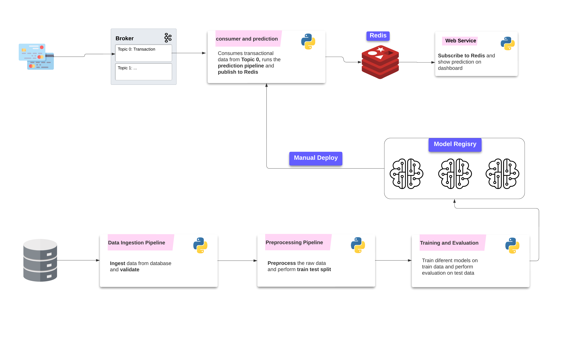

# Fraud Detection System

This project implements a **real time fraud detection system** using machine learning models to detect fraudulent activities based on transactional data. The project explores multiple models, including **RandomForest**, **ANN** and **Deviation Net**, for identifying anomalies and fraudulent transactions.

## Table of Contents
- [Project Description](#project-description)
- [System Architecture](#system-architecture)
- [Technologies Used](#technologies-used)

## Project Description
The goal of this project is to build a real time automated fraud detection system that can accurately classify fraudulent transactions based on various features. The dataset is available [here](https://www.kaggle.com/datasets/kartik2112/fraud-detection?select=fraudTrain.csv). The following roadmap has been prepared based on observations of exploratory data analysis - 
- **Preprocessing Steps**: 
   - Out of 22 features only 13 features have been selected for model buiding. 
   - Though transaction time was available, the data had not been treated as time series. Only **hour** of the transaction time was extracted as an extra feature. From the feature **dob**, age of the person was calculated.
   - Categorical features were encoded as **percentage of fradulent transactions** per category.
   - The EDA notebook is available [here](notebooks/eda.ipynb)

- **Model Building**:
   - The **first approach** was to **treat the problem as a classification task**. As the dataset was highly imbalanced synthetic minority oversampling method was applied beforehand. 
   - Three ML models were tried - LogisticRegression, DecisionTree and RandomForest. Out of these performace of RandomForest was found satisfactory. ANN based classifier was also tried.
   - The **second approach** was to treat the problem as an **Anomaly Detection task** without oversampling the training data. KMeans clustering and Isolation Forest were tried but not implemented as performnaces of those were not that good. 
   - After literature survey a **deep learning based anomaly detection method called Deviation Network** was implemented. The paper is availabe [here](deviationnet.pdf)

- **Performance Metrics**:
   - Permornace metrics of any problem is decided by business requirement. As the dataset is highly imbalanced **accuracy can be misleading**.
   - **Recall is an impotant** metric in fraud detection. **Higher recall** implies lesser false negatives, **causing lesser number of fradulent transactions being missed**.
   - **Precision** is also important. If precision is less there will be lot of false alarms. So, it **is a tradeoff betwen precision and recall.**

- **Model Evaluation and Observations**:
   - **RandomForestClassifier** with minority oversampling produced a **good balance of precision and recall**. But the same model **without minority oversampling produced great precision**. 
   - **ANN** based classifier with monirity oversampling produced very good recall, but precision was not that good. So, another kind of model was developed by taking **weighted averages of prediction scores from RandomForest without minority oversampling and ANN classifier** to strike a good balance of precision and recall.

      | Model Description    | Oversampling | Recall      | Precision |
      |----------------------|------------- |-------------|-----------
      | Random Forest 1      | Yes          | 0.7833      | 0.8941    |
      | Random Forest 2      | No           | 0.6492      | 0.9846    |
      | ANN                  | Yes          | 0.9187      | 0.2070    |
      | 0.5*RF 2 + 0.5*ANN   | -            | 0.8606      | 0.6676    |
      | 0.3*RF 2 + 0.7*ANN   | -            | 0.9001      | 0.3191    |
      | Deviation Net        | No           | 0.9187      | 0.1089    |
   
   - Is is evident that **ANN based models have impressive recall but lack precision**. Recall score of Deviation Net is great without oversampling, so **it is more suitable where very few labelled data is available**.

## System Architecture:
The system has two major sub-systems working in isolation - **Training and Inferencing**.
- **Training**:
   - It starts with data ingestion and validation stage followed by preprocessing, model training and evaluation.
   - ZenML has been used locally to impement the entire process through pipelines. (result screenshots - [data-ingestion](pipelines/pipeline3.png), [preprocessing](pipelines/pipeline1.png), [training](pipelines/pipeline2.png))

- **Inferencing**:
   - The inferencing system is developed as a real time one which consumes stream data from a source and generates prediction with low latency. 
   - There are two services involved. The **consumer service** consumes transaction data from a **topic of Kafka broker**, runs prediction pipeline on it and **publishes the prediction result to an in-memory database (Redis).**
   - The second service is a **web service which polls the data from the same in-memeory database and generates alerts** or notifications based on the prediction result.

   

      
   

   - The transaction data of genuine and fradulent transactions is simulated from a python script to test the latency of the system. Here is a small demonstration of the run on local machine. **(Kafka and Redis are running as docker containers. Prediction service and web service are running separately. Transaction data is being simulated from producer.py to test the system)**.

   

## Technologies Used
 - **Language**: python 3.12
 - **ML Framework**: Numpy, Pandas, Scikit Learn, Imbalanced Learn, ZenML
 - **DL Framework**: PyTorch
 - **Databases**: SQLite, Redis
 - **Streaming Data**: Quixstreams
 - **Web**: Flask, FlaskSocketIO, HTML, JavaScript
